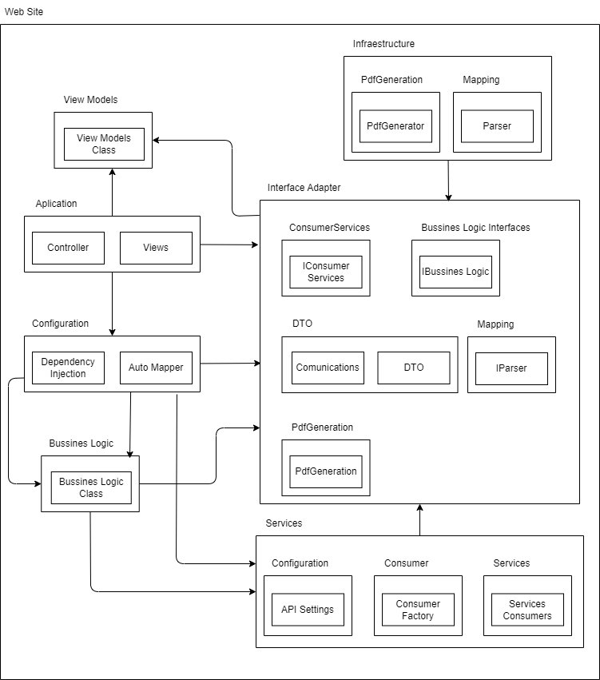

# EstadoCuenta_Prueba

Estado de cuenta de una tarjeta de crédito.

## Arquitectura

### EstadoCuenta_Prueba_API
La arquitectura de la solución API se encuentra representada en el siguiente diagrama:


#### Descripción de la Arquitectura del Servicio

1. **Aplicación**:
   - **Controller**: Es el punto de entrada para las solicitudes HTTP. Maneja las peticiones del cliente y delega las operaciones a las capas correspondientes (lógica de negocio, acceso a datos).

2. **Configuración**:
   - **Dependency Injection**: Facilita la gestión de dependencias entre componentes, asegurando que cada componente tenga acceso solo a lo que necesita.
   - **Auto Mapper**: Permite convertir datos entre diferentes modelos (por ejemplo, DTOs a ViewModels) automáticamente, reduciendo el esfuerzo manual.

3. **Interface Adapter**:
   - **Base de datos**:
     - **IUnitOfWork**: Define operaciones relacionadas con transacciones y persistencia en la base de datos, asegurando consistencia.
   - **Interfaces de lógica de negocio**:
     - **IBussines Logic**: Especifica las operaciones que el componente de lógica de negocio debe implementar.
   - **DTO (Data Transfer Object)**:
     - Encapsula datos que se transferirán entre capas.
     - Ejemplo: Response DTO, especializado en enviar datos al cliente.
   - **Mapping**:
     - **IParser**: Define la lógica para transformar datos de una representación a otra (por ejemplo, de DTO a ViewModel).
   - **Interfaces de acceso a datos**:
     - **IData Access**: Facilita las operaciones CRUD (crear, leer, actualizar, eliminar).

4. **Business Logic (Lógica de Negocio)**:
   - **Clase de lógica de negocio**: Implementa las reglas y procedimientos definidos por IBussines Logic. Actúa como puente entre los datos y el controller.

5. **Infraestructura**:
   - **Base de datos**:
     - **DataAccess**: Maneja consultas específicas y operaciones en la base de datos.
     - **DBContext**: Administra la conexión y las operaciones de la base de datos (generalmente utilizando un ORM como Entity Framework).
     - **Repository**: Abstrae el acceso a los datos, siguiendo el patrón de repositorio para separar la lógica de datos de la lógica de negocio.
     - **UnitOfWork**: Coordina el trabajo entre repositorios y asegura la consistencia durante las transacciones.
   - **Mapping**:
     - **Parser**: Proporciona la lógica para convertir datos entre capas, asegurando compatibilidad y optimización.

#### Ventajas de la Arquitectura:
1. **Separación de Responsabilidades**: Cada componente tiene una función específica, lo que facilita la mantenibilidad y escalabilidad.
2. **Modularidad**: Los módulos como Repository, UnitOfWork y Controller están desacoplados, lo que permite realizar cambios en una capa sin afectar a las demás.
3. **Flexibilidad**: Con Auto Mapper y IParser, se simplifica el manejo de datos entre capas y permite personalizaciones según las necesidades de presentación.

### EstadoCuenta_Prueba_Web
La arquitectura de la solución Web se encuentra representada en el siguiente diagrama:



#### Descripción de la Arquitectura del Servicio

1. **Website**:
   - Representa el núcleo del sitio web donde se gestionan la interacción con los usuarios y la presentación de los datos.

2. **View Models**:
   - **Clase de View Models**: Se encarga de definir los modelos que representan la información que se mostrará en las vistas. Sirven como intermediarios entre los datos de la lógica de negocio y las vistas.
   - Los ViewModels pueden incluir propiedades transformadas para adaptarse mejor a la presentación en la interfaz.

3. **Application**:
   - **Controller**: Maneja las solicitudes del cliente desde el front-end y actúa como intermediario entre las vistas y la lógica de negocio. Coordina las respuestas a las peticiones del usuario.
   - **Views**: Las interfaces gráficas y vistas donde el usuario interactúa, diseñadas con el enfoque en la usabilidad y accesibilidad.

4. **Configuration**:
   - **Dependency Injection**: Facilita la gestión de las dependencias entre los componentes del sitio web, asegurando que se mantengan desacoplados y fáciles de mantener.
   - **Auto Mapper**: Automatiza el mapeo de datos entre diferentes modelos, como DTOs y ViewModels, minimizando la lógica manual repetitiva.

5. **Business Logic**:
   - **Clase de Business Logic**: Implementa las reglas y la lógica de negocio necesarias para procesar datos provenientes de la API y transformarlos en información útil para el usuario.
   - Responsable de tomar decisiones basadas en las operaciones y datos recibidos del backend.

6. **Interface Adapter**:
   - Adapta la interfaz del sitio web para interactuar con la API y otros servicios externos.
   - **Consumer Services**: Define los servicios que consumen datos de la API y gestionan las solicitudes de comunicación.
   - **Business Logic Interfaces**: Contiene las interfaces que estandarizan cómo interactúa la lógica de negocio con otras capas.
   - **DTO (Data Transfer Object)**: Facilitan el intercambio eficiente de datos entre capas, asegurando que los datos sean transmitidos de manera estructurada.
   - **Mapping**: Incluye interfaces como **IParser**, responsables de transformar datos entre diferentes formatos, como DTOs a ViewModels.
   - **PdfGeneration**: Componente especializado para generar archivos PDF desde los datos procesados.

7. **Infrastructure**:
   - Proporciona el soporte técnico para las operaciones del sitio.
   - **PdfGeneration**: Contiene componentes como **PdfGenerator**, encargados de transformar información en documentos descargables.
   - **Mapping**: La clase **Parser** adapta datos para su uso interno y externo.

8. **Services**:
   - Capa de configuración y servicios adicionales:
     - **API Settings**: Administra las configuraciones necesarias para la conexión con la API (URLs, autenticación, etc.).
     - **Consumer Factory**: Proporciona una abstracción para crear consumidores que interactúen con la API.
     - **Services Consumers**: Define cómo los datos de la API son consumidos y utilizados por los distintos módulos del sitio web.

#### Principios y Ventajas de la Arquitectura
1. **Separación de Responsabilidades**: Cada capa tiene un rol específico, asegurando que los cambios en una no afecten directamente a las demás.
2. **Reutilización de Componentes**: Las clases e interfaces bien definidas permiten un alto grado de reutilización en diferentes módulos.
3. **Desacoplamiento**: Las dependencias están gestionadas a través de interfaces y técnicas como Dependency Injection, facilitando el mantenimiento y la extensibilidad.
4. **Escalabilidad**: La modularidad permite agregar nuevas funcionalidades, como el soporte para múltiples APIs, sin afectar las capas existentes.

Esta arquitectura técnica es ideal para sitios web dinámicos y robustos que necesitan consumir servicios de APIs externas mientras garantizan una experiencia de usuario eficiente y profesional.

## Instalación de la Base de Datos

Para configurar la base de datos, sigue los pasos a continuación. Los scripts están numerados en el orden en el que deben ejecutarse:

1. Ejecuta el script `1.Crear_BaseDatos.sql` para crear la base de datos.
2. Ejecuta el script `2.Crear_Tablas.sql` para crear las tablas necesarias.
3. Ejecuta el script `3.Crear_ProcedimientosAlmacenados.sql` para crear los procedimientos almacenados.
4. Ejecuta el script `4.Poblar_Tablas.sql` para poblar las tablas con datos iniciales.
5. Ejecuta el script `5.GenerarTransaccionesIniciales.sql` para generar las transacciones iniciales.

Todos los scripts se encuentran en la carpeta [BaseDatos](BaseDatos/).

## Configuración y Ejecución de las Soluciones

### Configuración de EstadoCuenta_Prueba_API

1. Abre el archivo `appsettings.json` en la carpeta `EstadoCuenta_Prueba_API` de la solución API.
2. Configura los valores de conexión a la base de datos:
   ```json
   "ConnectionStrings": {
       "DefaultConnection": "Server=<SERVIDOR>;Database=<NOMBRE_BASE_DATOS>;User Id=<USUARIO>;Password=<CONTRASEÑA>;"
   }

### Configuración de EstadoCuenta_Prueba_WEB

1. Abre el archivo `appsettings.json` en la carpeta `EstadoCuenta_Prueba_Web` de la solución WEB.
2. Configura la URL sobre la cual va a correr el servicio API:
   ```json
   "ApiSettings": {
    "EstadoCuentaApi_url": "https://localhost:7160"
  }
